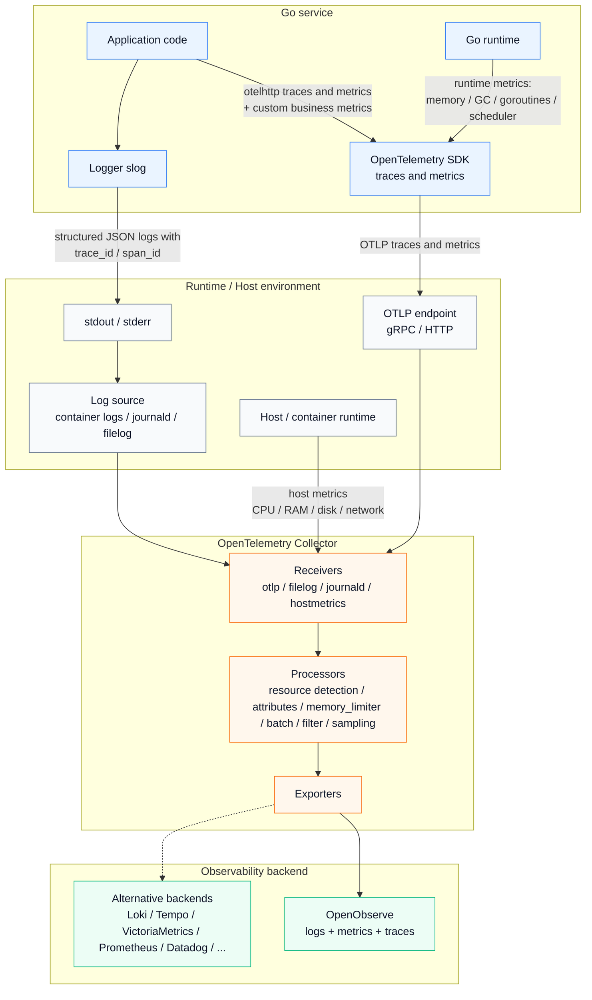

# Архитектура observability

Схема показывает путь observability-сигналов от Go-сервиса до backend-ов хранения и анализа.

Пакет `observability` отвечает за Go-side часть: настройку OpenTelemetry SDK, `otelhttp` instrumentation, Go runtime metrics, custom `Tracer`/`Meter` и OTLP export traces/metrics.

Пайплайны Collector, host metrics, сбор логов, хранение данных и маршрутизация в observability backend-ы относятся к инфраструктурному слою и настраиваются вне Go-пакета.

